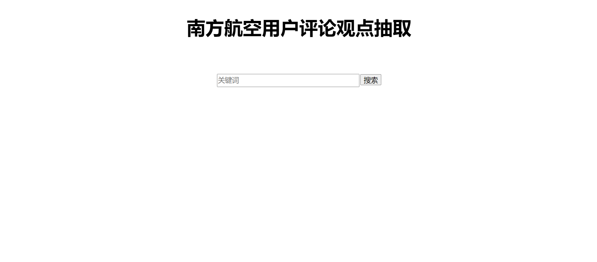
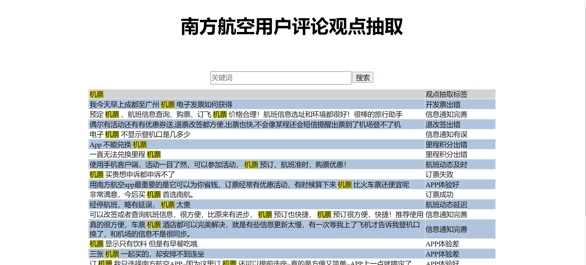

# search_demo
# 目录
# 模型安装
## 自动安装
可以在根目录直接运行如下命令，即可自动安装模型所需软件包。
```
pip install -r requirements.txt
```
## 手动安装
flask  
rank_bm25  
pandas  
collections  
jionlp  
time   
re  
# 程序启动
运行`hello.py文件`  
在任意浏览器输入网址http://127.0.0.1:5000/system 看到如下网页，即运行成功  

# 观点抽取搜索
在搜索框中输入任意关键字，点击搜索按钮，即可得到结果  
搜索“机票”，示例结果如下  

左列为用户评价，右列为对应抽取观点。对应关键字以黄色标注  
搜索结果同时输出csv文件，以时间戳命名保存，如下  

